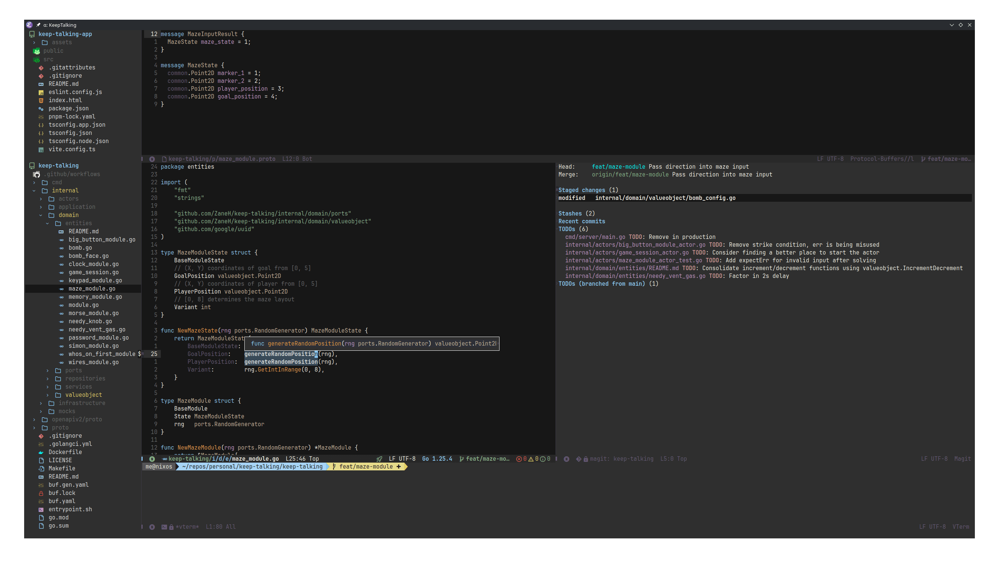

# emacs.d config

### Dependencies

**npm**

- `copilot-language-server`
- `prettierd`
- `typescript`
- `typescript-language-server`

**other**

- `docker`
- `git`
- `go`
- `gopls`
- `python`

## Preview

